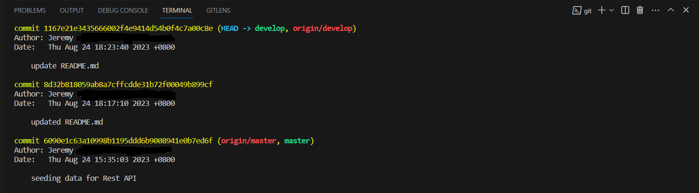
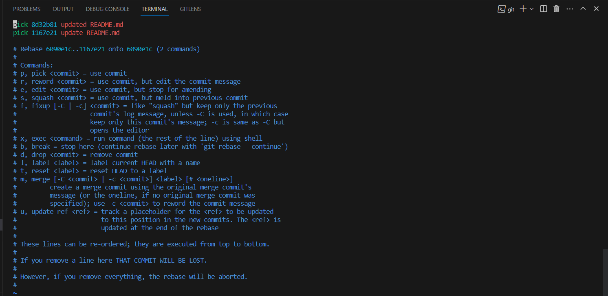
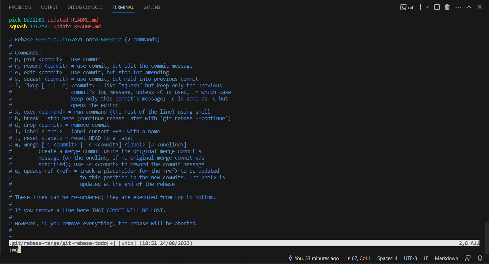
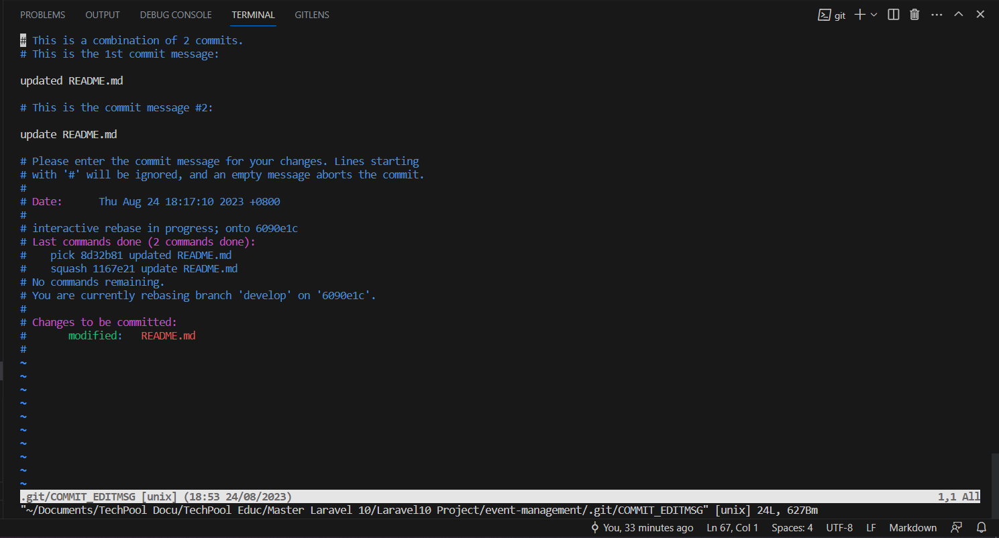
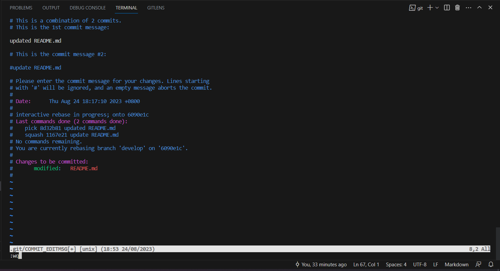
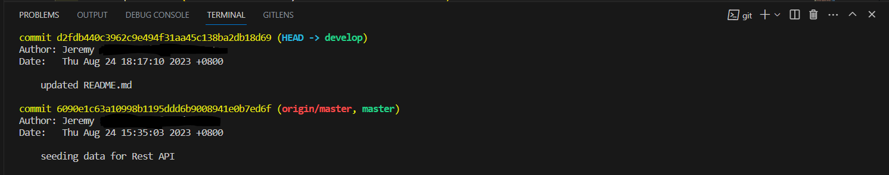

# How to make multiple commits squashed in one commit

### Run to see commit history
```bash
    git log
```


### Let's make the latest 2 commits in one commit


```bash
    # I used 2 to capture 2 latest commit
    git rebase -i HEAD~2
```
### It will open a tab with a list of commits


### Change the word `pick` to `squash` on commits you want to omit or remove


###### to save and exit the changes hit `ESC :wq`

### Another tab will pop up with messages of commits


### Comment the commit messages you want to remove


###### to save and exit the changes hit `ESC :wq`


### Check the commit log again by running
```bash
    git log
```


##### you see that there is no duplicate commit message

### then push our update 
```bash
    git push origin develop -f
```
